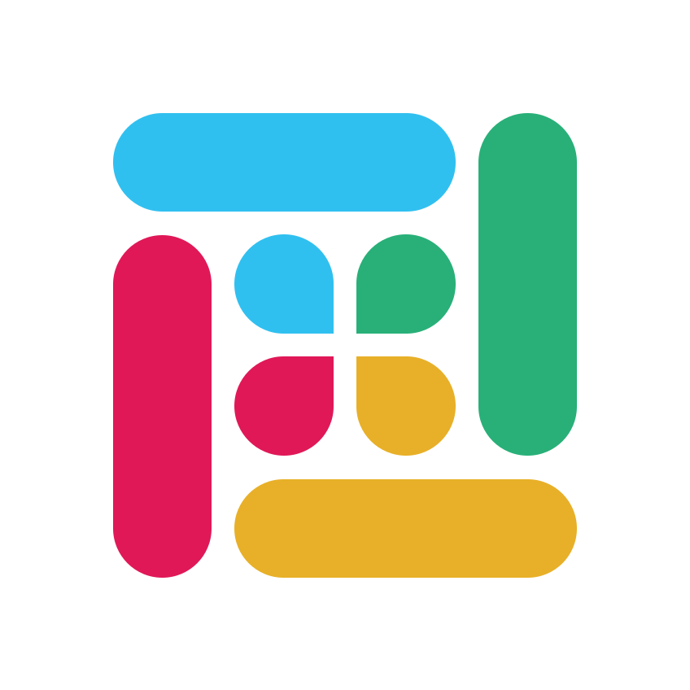
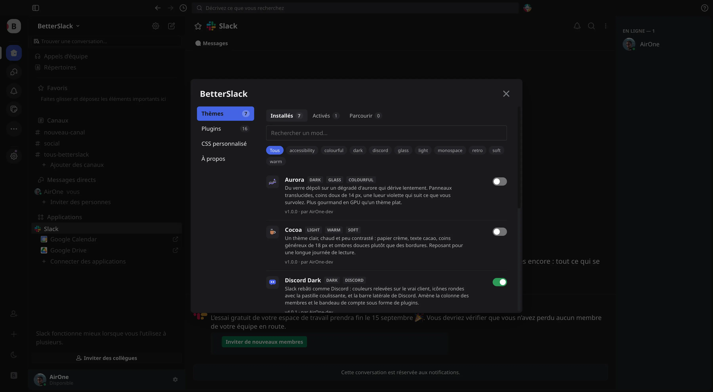
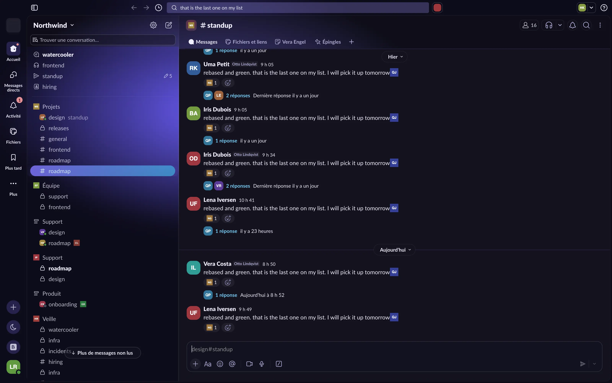
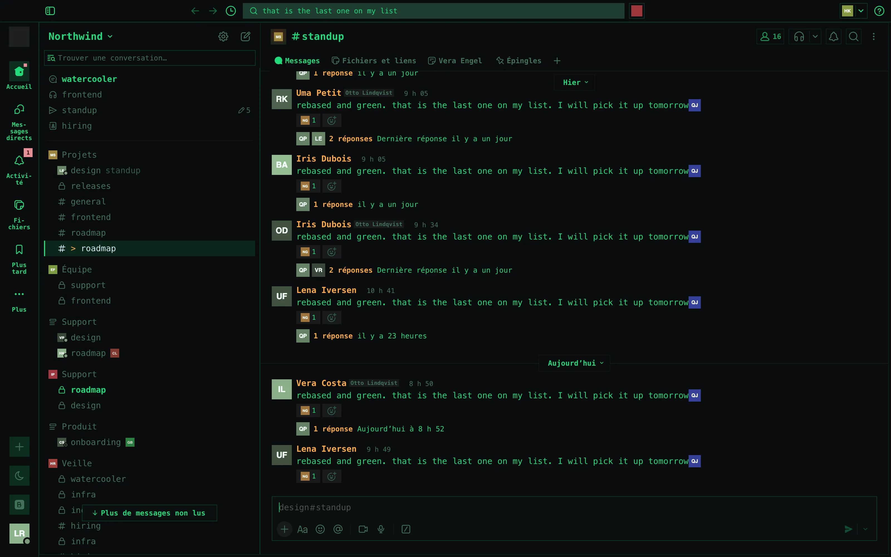
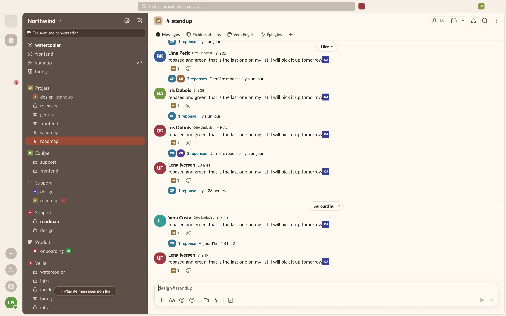
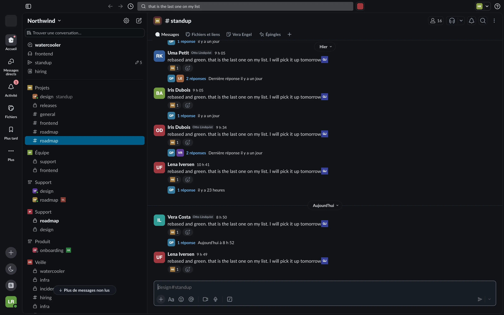
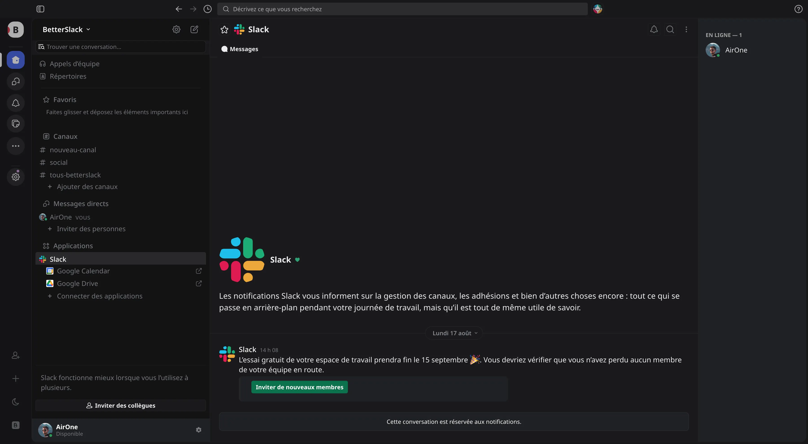
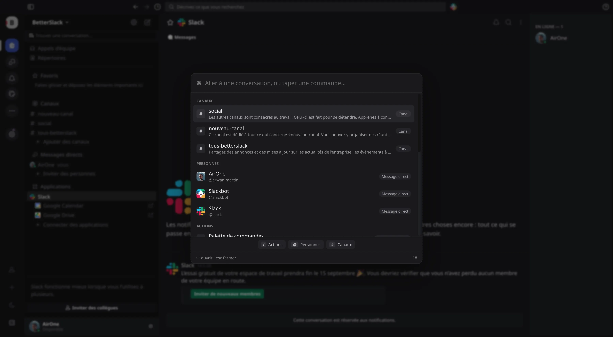
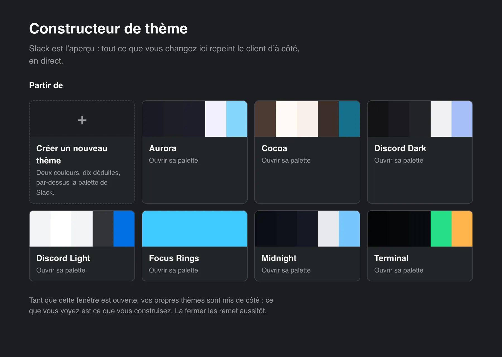
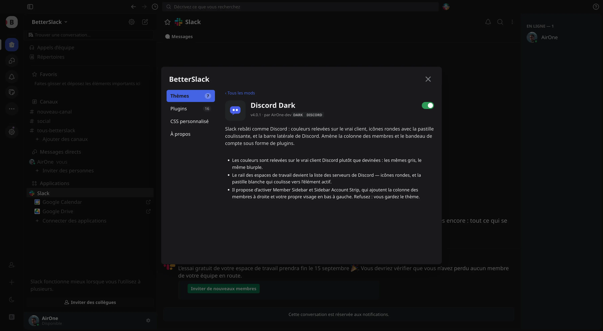

<p align="center">
  
</p>

<h1 align="center">BetterSlack</h1>

<p align="center">
  <strong>You know BetterDiscord. This is that, for Slack.</strong><br>
  Themes, plugins, a ⌘K palette and a theme builder — inside the Slack desktop
  app, without patching a single file of it.
</p>

<p align="center">
  <a href="https://airone-dev.github.io/BetterSlack/"><strong>airone-dev.github.io/BetterSlack</strong></a> ·
  <a href="docs/getting-started.md">Getting started</a> ·
  <a href="docs/api.md">API</a> ·
  <a href="docs/themes.md">Theming</a> ·
  <a href="CONTRIBUTING.md">Contributing</a>
</p>

<p align="center">
  
</p>

<p align="center"><em>⌘⇧M, or the sliders button above your avatar.</em></p>

## Seven themes, fifteen plugins, one keystroke

<table>
  <tr>
    <td width="50%"></td>
    <td width="50%"></td>
  </tr>
  <tr>
    <td><strong>Aurora</strong> — frosted glass over a drifting gradient.</td>
    <td><strong>Terminal</strong> — monospace, square corners, phosphor.</td>
  </tr>
  <tr>
    <td></td>
    <td></td>
  </tr>
  <tr>
    <td><strong>Cocoa</strong> — cream paper, cocoa text, soft shadows.</td>
    <td><strong>Midnight</strong> — a deeper, cooler dark.</td>
  </tr>
</table>

A theme is CSS and nothing else, so several can run at once. When a look needs
behaviour CSS cannot do, the theme names a plugin in `requires` and the panel
offers to switch it on — **Discord Dark** does exactly that, and brings the
member column and the account strip with it:

<p align="center">
  
</p>

### ⌘K, and everything is one keystroke away

<p align="center">
  
</p>

Slack's quick switcher with everything Slack has no idea about in the same list:
any conversation, anyone in the workspace (through Slack's own search, not just
your open DMs), every mod's commands, and a plugin's settings — `/` for actions,
`@` for people, `#` for channels.

### A theme builder whose preview is Slack

<p align="center">
  
</p>

Two colours become twelve roles across all four of Slack's token families,
hovering a colour outlines what it paints, and pointing at anything in the app
shows the tokens behind it. It writes ordinary CSS you can commit.

## Install

Requires **Node 20.19+, 22.13+ or 24+** and pnpm. That floor is jsdom's, which
the test harness uses: it `require()`s an ES module, so it needs a Node that
allows that. Node 22+ if you get pnpm through Corepack, since
pnpm 11 refuses to run on anything older when it is Node that runs it. Corepack
ships with Node, so `corepack enable` is enough; `npm i -g pnpm` and Homebrew's
standalone binary work too. It has to be pnpm: esbuild fetches its platform
binary in an install script, and only `pnpm-workspace.yaml` says which scripts
may run.

```bash
git clone https://github.com/AirOne-dev/BetterSlack.git
cd BetterSlack
nvm use                 # optional; .nvmrc pins the version CI uses
pnpm install && pnpm build
pnpm start
```

`pnpm build` is not optional: the loader and the runtime are TypeScript, `dist/`
is not committed, and `bin/betterslack.mjs` refuses to start without
`dist/loader.mjs`. You need it once after cloning and again after any change
under `src/` — never for a change under `mods/`, which hot-reloads into the
running client.

`pnpm start` restarts Slack with BetterSlack attached and stays running — mods are
active as long as it does. Nothing is installed on a fresh setup: open the panel
and install what you want from **Browse**.

On macOS, `pnpm build-app --install` puts a **BetterSlack.app** in
`~/Applications` so you can start it from Spotlight, the Dock or your login
items instead of a terminal. It is a launcher rather than a bundle — it runs
this checkout, so keep the project folder where it is.

Two things it needs. A C compiler at build time (`xcode-select --install`),
because the bundle's executable has to be a real binary rather than a shell
script. And, if the project lives on your Desktop or in Documents or Downloads,
macOS will ask once for permission to read it — say yes. Do not run the copy
left in `dist/`: an app inside one of those folders cannot read even its own
launcher, and a double-click does nothing at all.

**→ [docs/getting-started.md](docs/getting-started.md)** covers running it,
writing a theme, writing a plugin, testing and shipping.

## What is in the catalogue

**Themes** — Midnight (a deeper dark), Aurora (frosted glass over a drifting
gradient), Cocoa (warm light), Terminal (monospace phosphor), Discord Dark and
Discord Light (Slack rebuilt as Discord, colours sampled from the real client),
Focus Rings.

**Plugins** — Command Palette (⌘K, with `/` `@` `#` to narrow it), Theme Builder,
Motion (Slack with the frames in between), Code Highlight (twenty-one
languages, detected), Full Links (Slack stops shortening your URLs), Member
Sidebar, Sidebar Account Strip, Quote Reply, Copy Message Link,
Composer Character Count, Channel Notes, User Inspector, Avatar
Downloader, DevTools, Demo Mode (a Slack full of people who do not exist, for
when you are screenshotting or sharing your screen).

Each has a page in the panel — what it is for, in your language, with a picture
and its settings:

<p align="center">
  
</p>

Several themes can run at once. Terminal is the exception: it restyles through
`*` selectors, so run it on its own.

A mod carries its own version and updates on its own, so a fix to one theme does
not mean pulling the whole project. The panel also offers to update BetterSlack
itself — over git when there is a checkout, and by downloading the release from
GitHub when there is not.

## If something goes wrong

`pnpm start --safe` applies nothing, and so does the next start after a run that
never reported itself healthy — a mod that wedges the renderer cannot lock you
out. A mod that throws on start is named on its own row, and is skipped after two
failures until you switch it off and on again.

```bash
pnpm test:live        # boots the real Slack and checks what actually loaded
```

## How it works

BetterSlack attaches to Slack over the Chrome DevTools Protocol and injects a
runtime into the renderer. It never modifies `Slack.app`, so Slack updates
cannot break your install.

It talks to Slack over `--remote-debugging-pipe`, not `--remote-debugging-port`.
The port version opens an unauthenticated TCP listener that any local process
can use to drive your Slack session; the pipe uses two file descriptors handed
over at spawn time, and nothing listens on the network:

```console
$ lsof -nP -iTCP -sTCP:LISTEN -a -p $(pgrep -x Slack)
$                     # nothing
```

That does not protect against a program already running as your user — nothing
in user space can. Mods are active only while the loader runs, and Slack has to
be started by it.

## Writing a mod

Mods live in `mods/`, one folder each, picked up live with no rebuild:

```
mods/themes/<id>/mod.json    + theme.css
mods/plugins/<id>/mod.json   + index.js  + test.mjs
```

A theme is CSS. A plugin is an ES module exporting `start(api)` — and most of
what a mod needs is one call:

```js
export default {
  start(api) {
    api.slack.addToolbarButton('channelHeader', {
      id: 'hello', label: 'Say hello', icon: '<svg …>',
      onClick: () => api.ui.toast('Hello', { variant: 'success' }),
    });
  },
};
```

`entry` in `mod.json` is only where the app starts reading: a mod can be as many
files as it wants, imported relatively (`./lib/x.js`, or `@import './tokens.css'`
in a theme) from inside its own folder.

## Documentation

| | |
| --- | --- |
| **[Getting started](docs/getting-started.md)** | Run it · write a theme · write a plugin · test · ship |
| [API reference](docs/api.md) | Every entry, with an example |
| [Theming Slack](docs/themes.md) | The four colour token families, traps, recipes |
| [Contributing](CONTRIBUTING.md) | Review rules and the PR checklist |

## Development

```bash
pnpm check                        # everything below that CI would run, in one go
pnpm dev                          # rebuild on change
pnpm new-mod plugin my-plugin "What a user gets"   # a mod that already passes
pnpm test                         # every mod's tests
pnpm test -- <id>                 # one mod
pnpm test:core                    # loader and runtime unit tests
pnpm test:live                    # boot the real Slack and grade what loaded
pnpm check-structure              # is each mod loadable
pnpm validate-mods                # manifests
pnpm registry                     # regenerate mods/registry.json, then commit it
pnpm typecheck
pnpm release patch                # bump, write CHANGELOG.md, tag

pnpm site:dev                     # the presentation site, live at localhost:4321
pnpm site                         # regenerate site/data.js from the catalogue
```

Mods in `~/.betterslack/mods/` shadow the repo copies, which is handy for iterating
on something already merged.

## License

MIT
